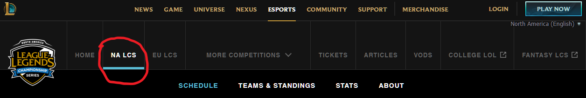
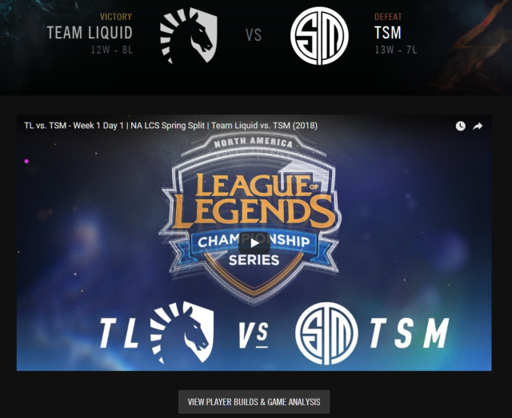
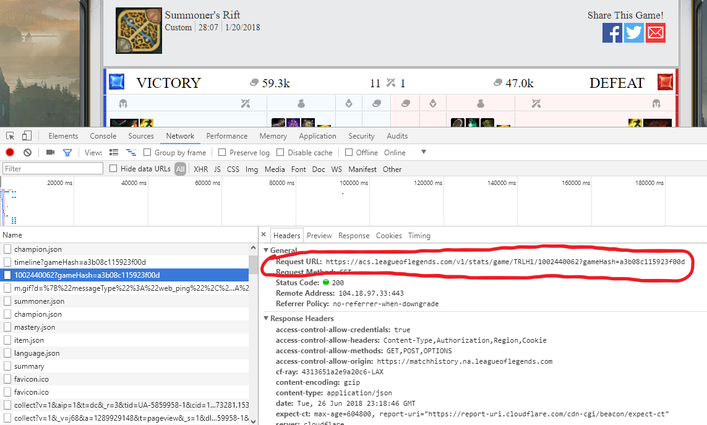
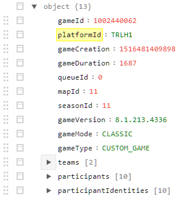
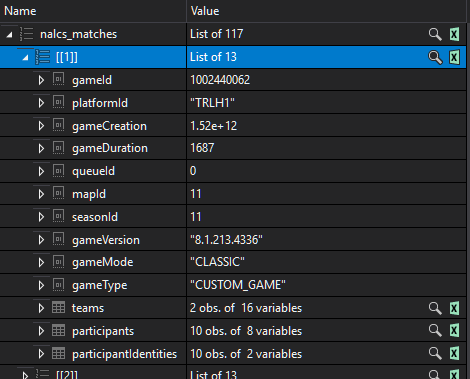
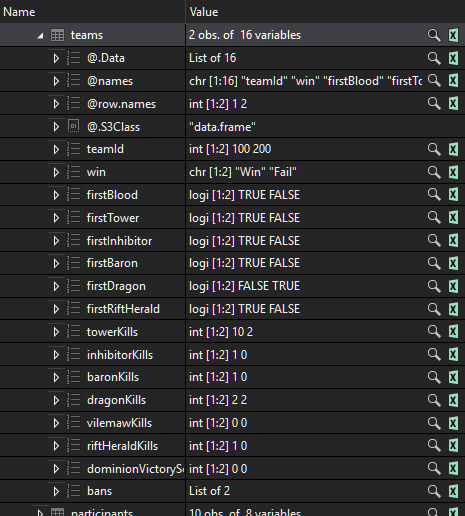
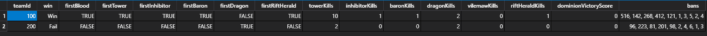

# Data Wrangling Report
#### by Ryan Transfiguracion
Before we start explaining the wrangling process, here are the "final" desired data frames for the NALCS 2018 Spring Split that we'll be using for later statistical analyses and models.  Click on the each link to see its corresponding CSV file:

[Entire Split Match-by-Match Team Totals](lol_pros_predictor/datasets/nalcs/nalcs_spring2018_regseason_match_totals.csv)

[Entire Split Match-by-Match Player Totals](lol_pros_predictor/datasets/nalcs/nalcs_spring2018_match_player_stats.csv)

[Entire Split Match-by-Match Champ Bans](lol_pros_predictor/datasets/nalcs/nalcs_spring2018_champ_bans.csv)

[Regular Season Team Cumulative Totals](lol_pros_predictor/datasets/nalcs/nalcs_spring2018_regseason_team_totals.csv)

[Regular Season Opposing Team Cumulative Totals](lol_pros_predictor/datasets/nalcs/nalcs_spring2018_regseason_oppsteam_totals.csv)


## Obtaining the Data for Making API Requests
All the match identifier data was obtained from lolesports.com.  For eample, in order to access a NALCS 2018 Spring Split match, click on the NA LCS link as shown below:


Then, slightly change the URL to this address: https://www.lolesports.com/en_US/na-lcs/na_2018_spring/schedule/regular_season/1 (presently, change the URL section saying "na_2018_summer" to "na_2018_spring").  Now, on the page, click on a single match.  This will lead to that match's page which will look like this:



From here, click on the button near the bottom of the page that says "VIEW PLAYER BUILDS & GAME ANALYSIS".  This will open a new Tab/Window on your browser for a page showing an overview of the match's statistics:


The URL of this page contains some important information that will be needed in order to call a Web API for this match.  In fact, the Web API call can be found by opening the Web Inspector for this page (typically by pressing Ctrl+Shift+I or Command+Shift+I).  

First, click on the Network tab of the inspector.  Then, we must refresh the page in order to see the list of web requests.  Eventually, we will find the request needed: 



The encircled Request URL is, in fact, the Web API call we use in our R script in order to obtain the JSON data for this particular match.  Every single match's Web API URI uses the same prefix: https://acs.leagueoflegends.com/v1/stats/game/.  Each match also has its own unique identifiers, as shown the browser URL and web inspector screenshots below:


Now that we know how to obtain the identifiers for each match, we can open a spreadsheet program and enter these identifiers, as well as the team names and flags indicating whether the match was a tiebreaker or playoff, into individual rows.  We can then save this spreadsheet as a CSV file, which will look like this in GitHub:


(This file can be viewed [here](https://github.com/ryanthtra/lol-esports-data-analysis/blob/master/lol_pros_predictor/gameid_data/NALCS_Spring2018.csv).)

As stated previously, the beginning string for the URL of the Web API for obtaining the match data JSON response is:

https://acs.leagueoflegends.com/v1/stats/game/

If we were to use the example match, the full string for this Web API is:

https://acs.leagueoflegends.com/v1/stats/game/TRLH1/1002440062?gameHash=a3b08c115923f00d

If we click on the link for this API on a browser, we should see a new tab/window that looks like this:


If we have a JSON beautifier extension installed on our browser, the response should look something like this:



Finally, we can start the R scripting!

## R Scripting for Obtaining Match Data

First, we will discuss how to obtain data for a single match.

In R, to be able to make http requests, we import the httr library.  Additionally, in order to translate the JSON response to an R-friendly object, we will use the jsonlite library:

```R
library(httr)
library(jsonlite)
```
Then, we construct the Web API request URI using the ```paste()``` function: 

```R
uri <- paste(acs_prefix_domain, "/v1/stats/game/", 
  chr_platform_id, "/", num_match_id, 
  ifelse(chr_game_hash != "", 
  paste("?gameHash=", chr_game_hash, sep = ""), ""), sep = "")
```
In the block above, if we use the example match again, ```acs_prefix_domain``` is https://acs.leagueoflegends.com, ```chr_platform_id``` is TRLH1, ```num_match_id``` is 1002440062, and ```chr_game_hash``` is a3b08c115923f00d.

With the ```uri``` constructed, we use this string to make the API request within a custom function, ```process_uri()```:

```R
process_uri <- function(str_uri) {
  response <- httr::GET(str_uri)
  while (response$status_code == 429) {
    Sys.sleep(2)
    response <- httr::GET(str_uri)
  }
  json <- jsonlite::fromJSON(content(response, as = "text"))
  return(json)
}
```
Note the statement ```while (response$status_code == 429)```.  The server to which we are making this request restricts the user to making a certain limited number of requests within a certain timeframe (unknown to this author).  If we go beyond this restriction during a request, the response will return a status code of 429, and we wouldn't get the data from that match.  Therefore, we are watching for this response status code, and if we get a 429, then we sleep the R runtime for two seconds before making the same request again.  Theoretically, we should get the desired 200 response code and the match data the second time around.

#### Obtaining Match Data for Multiple Matches
First, we import the CSV file that we created, which contains all the match identifiers:
```R
# NA LCS 2018 Spring Split -- Regular Season, Tiebreakers, and Playoffs
nalcs_matchid_df <- read.csv("gameid_data/NALCS_Spring2018.csv")
```
Next, we, call the custom function that makes a request for each of the 117 NALCS 2018 Spring Split matches and then returns a List object containing the 117 match datas:
```R
nalcs_matches <- get_league_match_data_list(nalcs_matchid_df)
```
Here is the custom function, ```get_league_match_data_list()```:
```R
get_league_match_data_list <- function(league_matchid_df) {
  matchlist <- list()
  for (i in 1:nrow(league_matchid_df)) {
    matchlist[[i]] <- get_acs_match_by_matchid(league_matchid_df$Region.ID[[i]],
     league_matchid_df$Game.ID[[i]], 
     chr_game_hash = league_matchid_df$Hash.ID[[i]])
  }
  return(matchlist)
}
```

#### Looking Deeper into Match Data
Now that we have match data for all 117 matches in the NALCS 2018 Spring Split, let's look at a single match:



Here, we can see the ```gameId``` and ```platformId``` strings that we used in the Web API call.  We also see the ```gameDuration``` numeric, which we will need for our "final" datasets.  However, the meat of our datasets are coming from the three data frames at the bottom: ```teams```, ```participants```, and ```participantIdentities```.  Let's look at ```teams``` first:



Also, let's look at the it in preview mode:


Before concatenating this into a cumulative data frame, this will get cleaned up in order to be useful.  The explanations are written into the code for the custom function ```get_accum_matches_teams```:

```R
# Place this line at the top of the script file
library(dplyr)
nalcs_matches_teams_accum <- get_accum_matches_teams(nalcs_matches, nalcs_matchid_df)
```
```R
get_accum_matches_teams <- function(league_matchlist, league_matchid_df) {
  league_matches_teams_accum <- data.frame(NULL)
  for (i in 1:length(league_matchlist)) {
    # Convert win column (Win/Fail) to logical (TRUE/FALSE)
    league_matchlist[[i]]$teams["win"] <- as.logical(eval(league_matchlist[[i]]$teams["win"]) == "Win")
    # Add team names column
    league_matchlist[[i]]$teams["teamName"] <- unname(unlist(c(league_matchid_df[i, c("Blue.Team", "Red.Team")])))
    # Add game number column
    league_matchlist[[i]]$teams["gameNumber"] <- c(i, i)
    # Add tiebreaker and playoff column
    league_matchlist[[i]]$teams["isTiebreaker"] <- unname(unlist(c(league_matchid_df[i, c("Tiebreaker", "Tiebreaker")])))
    league_matchlist[[i]]$teams["isPlayoff"] <- unname(unlist(c(league_matchid_df[i, c("Playoff", "Playoff")])))
    # Add game duration 
    league_matchlist[[i]]$teams["duration"] <- rep(league_matchlist[[i]]$gameDuration, 2)
    
    # Concatenate rows from current match onto the accumulation DF
    league_matches_teams_accum <- league_matches_teams_accum %>% bind_rows(league_matchlist[[i]]$teams %>% select(-bans))
  }
  # Change all teamId = 100/200 to Blue/Red
  # and remove some irrelevant columns
  league_matches_teams_accum <- league_matches_teams_accum %>%
    mutate(teamId = replace(teamId, grepl('100', teamId), 'Blue')) %>%
    mutate(teamId = replace(teamId, grepl('200', teamId), 'Red')) %>%
    select(-vilemawKills, -dominionVictoryScore)
  return(league_matches_teams_accum)
}
```

Now, let's look at the ```participants``` and ```participantIdentities``` data frames:


There are a lot of nested data frames within the data frame, but fortunately, each observation in each data frame corresponds with each player in the match, as shown by that each nested data frame (```stats```, ```timeline```, and ```xxxPerMinDeltas```) plus the ```participantIdentities``` DF has a ```participantId``` column.  Thus, we can join them together.  However, the ```timeline``` data frame itself has a lot of nested DFs, and each those DFs have the same column names (``` `10-20` ```, ``` `0-10` ```, etc.).  We will use the ```jsonlite::flatten()``` function on the ```timeline``` DF and then join all the previously mentioned nested DFs together:

```R
ret_df <- match_participants_df %>%
    # Remove the nested stats and timeline DFs
    select(-stats, - timeline) %>%
    # Bind with the participantIdentites$player DF
    bind_cols(match_participantids_df$player) %>%
    # Join with the separate champions DF (by championId column)
    inner_join(champions_df_simple) %>%
    # Join with the stats DF (by participantId column)
    inner_join(match_participants_df$stats) %>%
    # Join with timeline DF (by participantId column)
    inner_join(match_participants_df$timeline %>% flatten())
```

Next, like with the ```teams``` DF, we add ```gameNumber```, ```isTiebreaker```, ```isPlayoff```, ```duration```, and ```Blue``` and ```Red``` team columns to the newly-joined ```participants``` DF.

Addionally, we want to add the a ```teamRole``` column to the ```participants``` DF.  Luckily, through personal observation and knowledge of the game and the eSport, we know that the players on each team are placed, in the DF, in the same order by their role: Top, Jungle, Mid, Bottom Carry, and Support.  Therefore, we can write such a script accordingly:

```R
flattened_df['teamRole'] <- NULL
# Get team roles
for (j in 1:nrow(flattened_df)) {
  if        (flattened_df[j, 'participantId'] == 1 || 
             flattened_df[j, 'participantId'] == 6) {
    flattened_df[j, 'teamRole'] = "TOP"
  } else if (flattened_df[j, 'participantId'] == 2 || 
             flattened_df[j, 'participantId'] == 7) {
    flattened_df[j, 'teamRole'] = "JUNGLE"
  } else if (flattened_df[j, 'participantId'] == 3 || 
             flattened_df[j, 'participantId'] == 8) {
    flattened_df[j, 'teamRole'] = "MID"
  } else if (flattened_df[j, 'participantId'] == 4 || 
             flattened_df[j, 'participantId'] == 9) {
    flattened_df[j, 'teamRole'] = "BOTCARRY"
  } else {
    flattened_df[j, 'teamRole'] = "SUPPORT"
  }
}
```

Concatenating the multiple ```participants``` DFs together is very similar to when we put together the ```teams``` DFs, so we won't include a code sample here; we basically ran a for loop through all the matches data, wrangled each ```participants``` sub-DF, then used ```bind_rows()``` to add it to an accumulative DF of all the other ```participants``` DFs.  With that, we have our match-by-match player totals data set, as shown here and at the top of the report:

[Entire Split Match-by-Match Player Totals](lol_pros_predictor/datasets/nalcs/nalcs_spring2018_match_player_stats.csv)

#### Creating Match-by-Match Team Totals Dataset

Now that we have the player totals data set, we can use that set to add up the totals of each player of each team of each match to create team totals for each match.  With the custom function ```get_match_combined_participant_stats_df()```, we add up the stats of the five players of one team in one match, as shown below:

```R
get_match_combined_participant_stats_df <- function(match_team_df) {

  # Replace all the NAs in the "Deltas" columns with zeroes 
  match_team_df <- match_team_df %>%
    mutate_at(vars(contains("Deltas")), funs(replace(., is.na(.), 0)))

  # Groups observations by game number and team name
  # (the other group-by variables are used just so they can be included in the output DF)
  # Sums up a bunch of columns together 
  match_team_df <- match_team_df %>%
    group_by(teamName, teamId, win, gameNumber, duration, isTiebreaker, isPlayoff) %>%
    summarize_at(vars(kills:assists, totalDamageDealt:trueDamageDealt, totalDamageDealtToChampions:goldSpent, totalMinionsKilled:wardsKilled, 'creepsPerMinDeltas.10-20', 'creepsPerMinDeltas.0-10', 'xpPerMinDeltas.10-20', 'xpPerMinDeltas.0-10', 'goldPerMinDeltas.10-20', 'goldPerMinDeltas.0-10', 'damageTakenPerMinDeltas.10-20', 'damageTakenPerMinDeltas.0-10'), sum)
  return(match_team_df)
}
```

As indicated in the code sample above, we encountered some ```NA```s in the ```participants``` data set.  While there are a few outliers, most of the ```NA```s occur, because some matches do not last longer than 30 minutes, so any of the ```XxxPerMinDelta.30-end``` columns do not apply to those matches.  

With this new teammates-summed-up-per-match DF created, we can now join this together with the accumulated ```teams``` DF to create the ***match-by-match team totals*** dataset, as shown in this code snippet:

```R
# Joins the "teams" DF and the "participants combined" DF together
nalcs_matches_tpc_accum <- nalcs_matches_participants_combined_accum %>%
  inner_join(nalcs_matches_teams_accum)
```
And here is the link to the dataset (same as at the top of the report): [Entire Split Match-by-Match Team Totals](lol_pros_predictor/datasets/nalcs/nalcs_spring2018_regseason_match_totals.csv)

#### Creating Regular Season Team Totals Dataset
With the new ***match-by-match team totals*** dataset, we can add up the stats of each team across an entire regular season.

First, we filter out the regular season matches:
```R
# Filter for just regular season games
league_regseason_tpc_df <- league_matches_tpc_accum %>%
  filter(isTiebreaker == FALSE & isPlayoff == FALSE)
```

Then, we group the rows of the DF by team and add up the numerical stats:
```R
league_regseason_team_totals_df <-
# First parentheses group: sums of stats by team
(league_regseason_tpc_df %>%
  group_by(teamName) %>%
  summarise_at(vars(duration, kills:wardsKilled, towerKills:riftHeraldKills,
    'creepsPerMinDeltas.10-20', 'creepsPerMinDeltas.0-10', 'xpPerMinDeltas.10-20',
    'xpPerMinDeltas.0-10', 'goldPerMinDeltas.10-20', 'goldPerMinDeltas.0-10',
    'damageTakenPerMinDeltas.10-20', 'damageTakenPerMinDeltas.0-10'), sum)) %>%
    ...
```

Then, we continue by tallying most of the TRUE/FALSE columns:
```R
# Include tidyr package at top of script file so we can use spread(
library(tidyr)
  ...
  # More parenthesis groups: tallying first-objective columns
  inner_join(league_regseason_tpc_df %>%
    group_by(teamName, firstBlood) %>%
    tally() %>% spread(firstBlood, n) %>% select('TRUE') %>% 
    rename('firstBloods' = 'TRUE')) %>%
  inner_join(league_regseason_tpc_df %>%
    group_by(teamName, firstTower) %>%
    tally() %>% spread(firstTower, n) %>% select('TRUE') %>% 
    rename('firstTowers' = 'TRUE')) %>%
  ...
```

Then, we tally the wins and losses:
```R
  ...
  # Last parentheses group: tallying wins and losses by team
  inner_join(league_regseason_tpc_df %>%
    group_by(teamName, win) %>%
    tally() %>%
    spread(win, n) %>% # "transposes" the DF so that TRUE (win) and FALSE (loss) are the column names
    rename('losses' = 'FALSE', 'wins' = 'TRUE')) # renames the T/F columns to W/L
```

Finally, we re-order the columns in this big joined DF:
```R
# Reordering columns - teamName, wins, losses, <everything else>
league_regseason_team_totals_df <- league_regseason_team_totals_df[, c(1, 56, 55, 2:54)]
```

We now have the ***regular season team totals*** dataset: [Regular Season Team Cumulative Totals](lol_pros_predictor/datasets/nalcs/nalcs_spring2018_regseason_team_totals.csv)

#### Creating Regular Season Opponent Totals Dataset
Here we go back to using the ***match-by-match team totals*** dataset, and then, for each match, we just swap the team names by using ***dplyr***'s ```lead()``` and ```lag()``` functions:
```R
# Get opponent's data (just swapping the team names of each game in the previous DF)
nalcs_matches_tpc_opps_accum <- nalcs_matches_tpc_accum %>%
  group_by(gameNumber) %>%
  mutate(teamName = ifelse(teamId == "Blue", 
    as.character(lead(teamName)), 
    as.character(lag(teamName))
  ))
```
Then, we just use the same procudure we used to create the ***regular season team totals*** data set.  Here's the link to the ***regular season opponent totals*** dataset:

[Regular Season Opposing Team Cumulative Totals](lol_pros_predictor/datasets/nalcs/nalcs_spring2018_regseason_oppsteam_totals.csv)