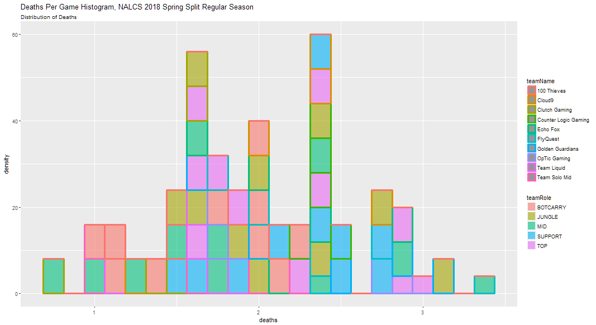
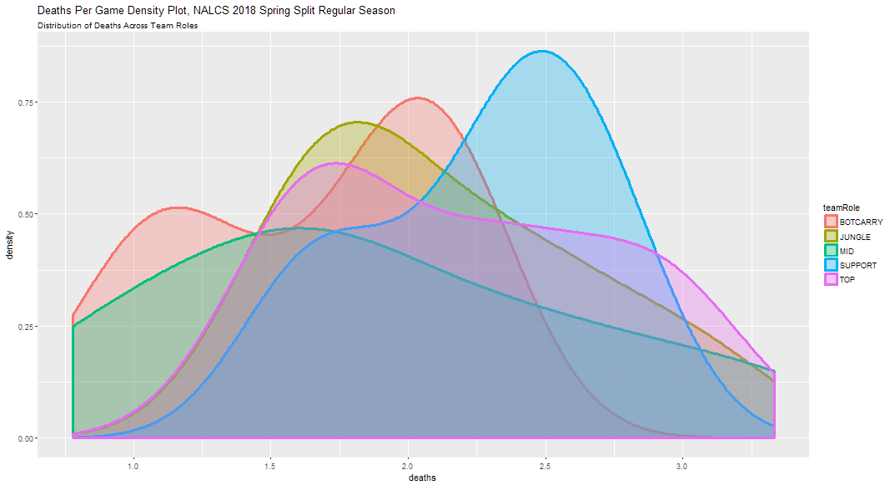
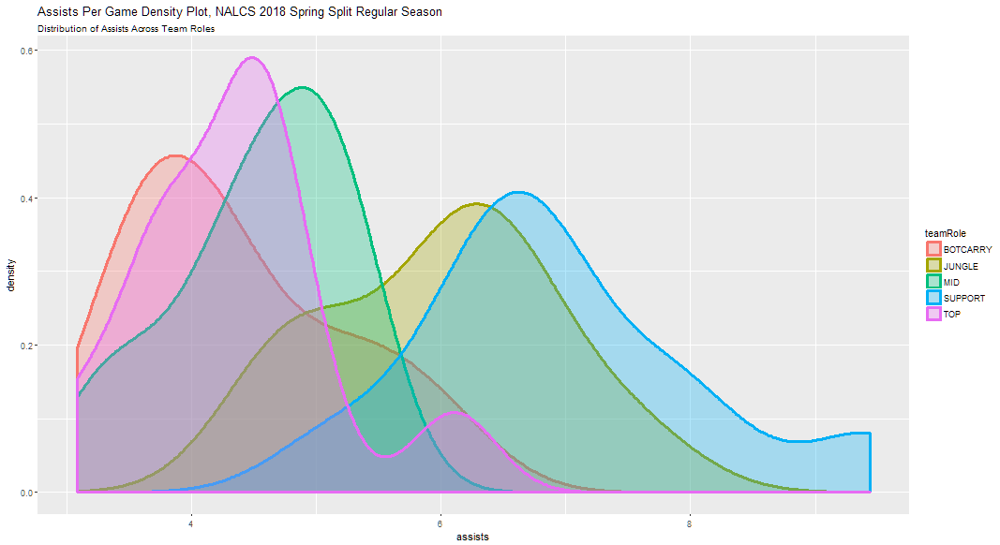
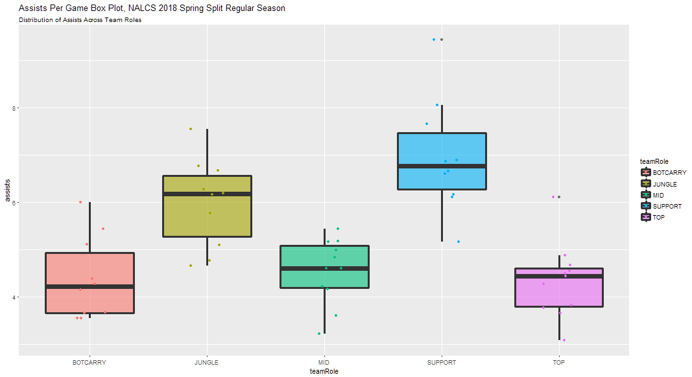
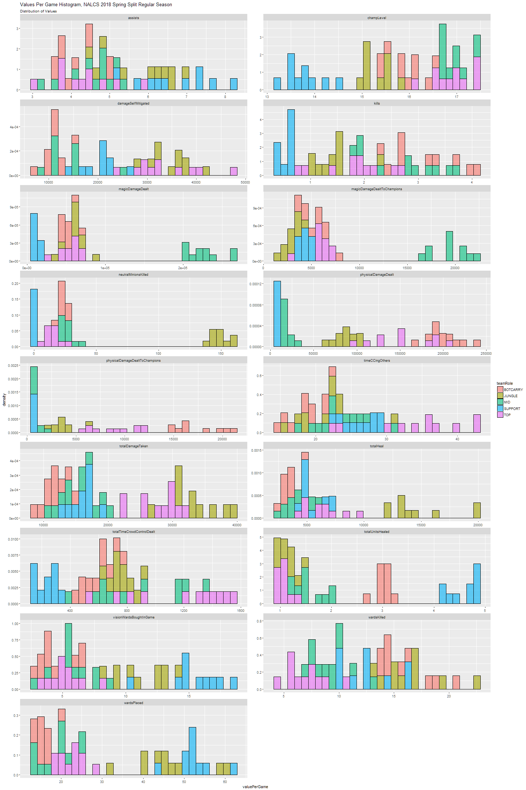
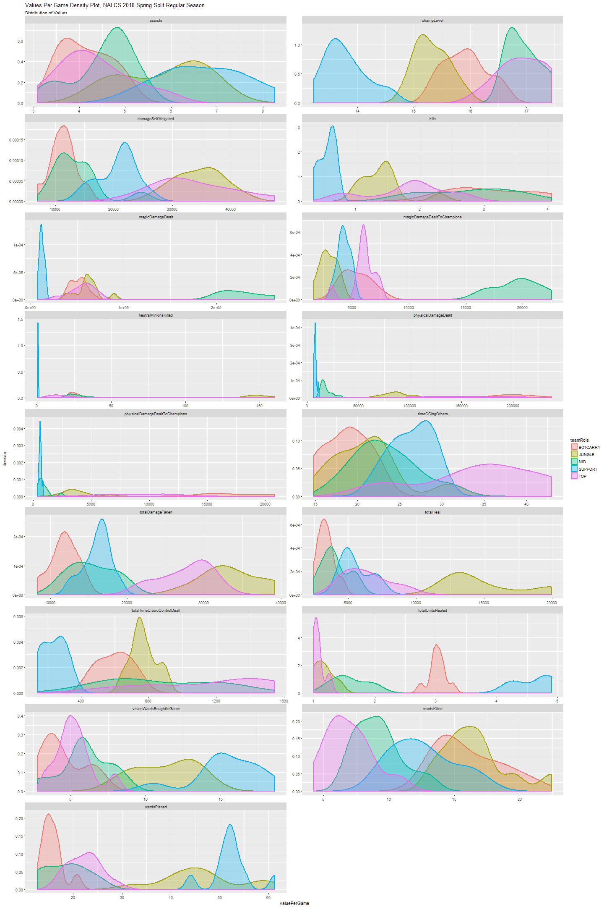
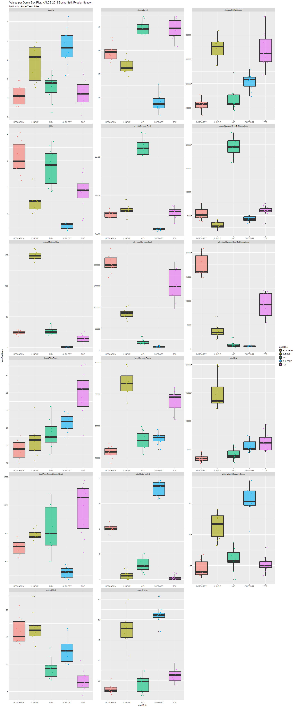

# Exploratory Analysis Report
#### by Ryan Transfiguracion

## Exploring Player and Team Role Performances
As we skimmed through the NALCS player averages data frame (first, by taking the match-by-match player stats dataset [here](lol_pros_predictor/datasets/nalcs/nalcs_spring2018_match_player_stats.csv), grouping by player name and team role, and then taking a mean summary of most of the numerical columns) and sorted the observations by individual columns, it was clear that certain team roles were generally grouped at the top, bottom, or middle of the lists ofindividual statistics.

First, let's look at some plots for ***kills per game*** in the NALCS:

It's pretty clear in all three plots that Supports achieve the least number of kills per game, followed by Junglers and Top Laners, while Mid Laners and Bottom Lane Carries and mixed together at the top.

Now, let's look at ***deaths per game***:

While team roles are clumped closer together for deaths per game compared to the kills per game statistic, we see that Top Laners and Supports are typically die the most often.  

In a typical League of Legends game, the Top Laner is the most isolated role during the laning phase, and, thus, is most vulnerable to a gank (an amalgam of "gang flank", or slang for "group kill") by the enemy Jungler assisting with the enemy Top Laner.  

Supports are typically the weakest roles when combining both damage output and defense, and their protective abilities (e.g., healing, providing shields) are usually prioritized for their teammates.  Thus, they are usually prioritized by the enemy team in group fights because of their abilities to help their teammates survive.

Now, let's look at ***assists per game***.  To clarify, an assist is usually achieved by either dealing damage or hindrance abilities (i.e. debuffs and crowd control [CC]) to a killed enemy champion without dealing the killing blow themselves, or providing protection or augmenting abilities (i.e., buffs) to a teammate who deals the killing blow to an enemy champion:

We see nearly the opposite of ***kills per game***.  Supports followed by Junglers average the most assists in a game.  Supports typically, though lacking in damage output, provide the most protection, CC, buffs, and/or debuffs, while Junglers provide ganks for their teammates since they roam throgh most of the map.

Below are collections of histograms, density plots, and box plots faceted by 17 different variables, in alphabetical order, showing player averages per game through the entire 2018 Spring Split (regular season, tiebreakers, and playoffs):

As we can see through these plots, team roles can be clearly defined by certain characteristics and statistics:

***Top Laner***: least assists, least healing others, most true damage dealt, most CC time dealt 

***Jungler***: most heal, most total damage taken and self-mitigated, highest vision score, most wards killed, most neutral minions killed

***Mid Laner***: most magic damage dealt to champions, one of highest finishing champ levels

***Bottom Lane Carry***: most total damage dealt to champions, most physical damage dealt, least heal, least total damage taken

***Support***: lowest kills, lowest damage dealt, highest assists, most unites healed, most vision wards bought, lowest finishing champ level

We will use this dataset and lean on such distinguishable statistics to eventually make a classification model.